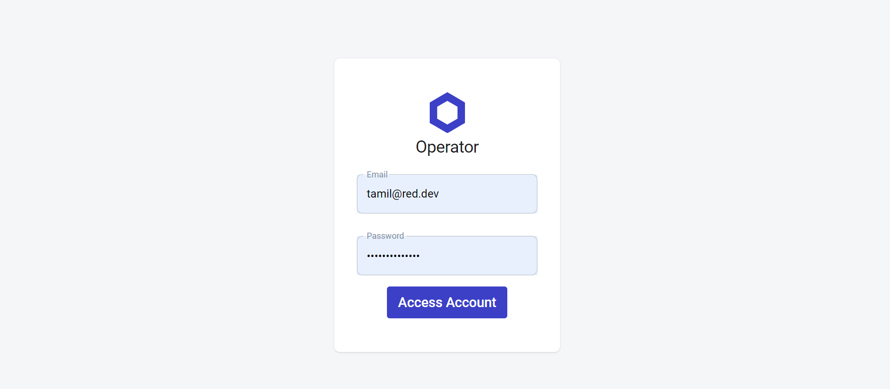
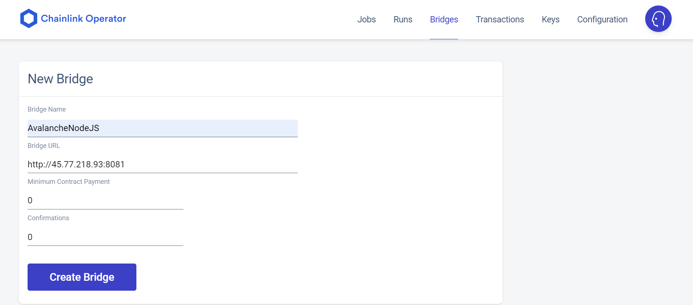
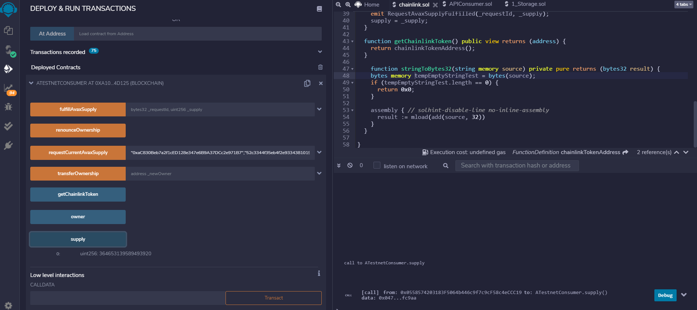

# Introduction

This tutorial will show you how to setup Chainlink node with Avalanche Fuji Testnet and create a smart contracts connect to the chainlink node.

We at [red·dev](https://www.red.dev) needed to do this for our current software project under development, [RediYeti](https://www.rediyeti.com). We have a use-case where we need to verify ownership of an Avalanche X-Chain address before the dApp sends funds related to this address. To prevent fraud, the verification must take place inside the dApp.
You may also find this tutorial useful if you would like to learn how Avalanche signatures work and how cryptography is implemented on the X-Chain and on the C-Chain. 

We have included a complete ansible scripts to create a development server using vultr vps , and you can find the entire project [here](ansible-chainlink-avalanche-setup). Many steps are involved, but once you understand how they fit together, you will have a deeper understanding of how this work.
## Audience
To get the most out of this tutorial, you will need to have a basic understanding of Docker, Chainlink, Javascript, Node, Solidity, and how to write Smartcontracts. If you do not yet know about these topics, see the [**Resources**](#resources) section at the end for links to learn more.


## Overview

At the very highest level, here is an overview of the process we will go through in this tutorial. First we are going to install the neccessary sofwares required to run the chainlink node and then it will explain how to run the chainlink node within the docker container. After, that with the help of the chainlink GUI we can create a simple job which will be used in a smart contract.

# Prerequisite

1. Ubuntu >= 20.10 or later
2. [Docker-CE](https://docs.docker.com/get-docker/)
3. [Go Lang 1.16.6](https://storage.googleapis.com/golang/go1.16.6.linux-amd64.tar.gz)
4. AvalancheGo >= [v1.4.5](https://github.com/ava-labs/avalanchego.git)
5. Metamask wallet with Avalanche Fuji Testnet

## Install Docker Container

The first step is to install Docker-CE. Docker-CE (community edition) is a free version of Docker that you can use to spin up containers without having to pay for enterprise-level support

Open a terminal session and execute the below command,
```bash
$ curl -sSL https://get.docker.com/ | sh
```
Manage Docker as a non-root user, create a docker group and add your user to it.
```bash
$ sudo groupadd docker
$ sudo usermod -aG docker $USER
```
Verify that you've installed docker by running the below command

```
$ docker -v
```


The next step is to download and install the Go Lang which is required for building the AvalancheGo later in this section

## Install Go Lang

Download the Go Lang package. We have used the version 1.16.6 for this tutorial
```
$ wget https://storage.googleapis.com/golang/go1.16.6.linux-amd64.tar.gz
```
Extract the go1.16.6.linux-amd64.tar.gz to /usr/local
```
$ tar -C /usr/local -xzf go1.16.6.linux-amd64.tar.gz
```
Add /usr/local/go/bin to the PATH environment variable. You can do this by adding the following line to your $HOME/.profile or /etc/profile (for a system-wide installation):

```
export PATH=$PATH:/usr/local/go/bin
```
Verify that you've installed Go by running the below command

```
$ go version
```


## Build AvalancheGo image

Clone the AvalancheGo repository

```
$ git clone https://github.com/ava-labs/avalanchego.git
```

Build the image into docker

```
$ cd avalancghego
$ ./scripts/build_image.sh
```

To check the build image run the below command
```
$ docker images
```


The image should be tagged as avaplatform/avalanchego:xxxxxxxx, where xxxxxxxx is the shortened commit of the Avalanche source it was built from. In our case it is 254b53da.


# Setup & Running a Chainlink node

## Dependencies 
1. Docker CE
2. Smartcontract/chainlink v0.10.3 
3. AvalancheGo >= 1.4.5
4. PostgreSQL

## Steps to run chainlink node

### 1. Run AvalancheGo
The first step is to run the avalanchego within docker which will map the port 9650 & 9651 in the container to the TCP port 9650 & 9651 on the docker host.

Use the below command to run the avalanchego image within docker

```
$ docker run --name avalanchego-chainlink -d -p 9650:9650 -p 9651:9651 -v /root/.avalanchego:/root/.avalanchego avaplatform/avalanchego:91599fea /avalanchego/build/avalanchego --network-id=fuji --http-host=
```
 * --name assign a name to the container
 * -d specifies detached mode
 * -p specifies the port number
 * -v specifies the docker host location to store the container volume data
 * /avalanchego/build/avalanchego --network-id=fuji is the command to start the avalanchego under fuji test network
  
To verify the avalanchego node is started and running by the below command

```
$ docker ps
```
it will list the avalanchego container status


Also, you can check by requesting a CURL command like below,

```
$ curl -X POST --data '{
    "jsonrpc":"2.0",
    "id"     :1,
    "method" :"info.isBootstrapped",
    "params": {
        "chain":"C"
    }
}' -H 'content-type:application/json;' 127.0.0.1:9650/ext/info
```


### 2. Run PostgreSQL

The next step is to run the postgreSQL within the docker container

Use the below command to run the postgreSQL. The POSTGRES_PASSWORD & POSTGRES_USER are the environment variables used to set the postgreSQL superuser & superuser password

```
$ docker run --name pgchainlink -e POSTGRES_PASSWORD=chainlink -e POSTGRES_USER=chainlink -d -p 5432:5432 -v /root/postgres-data/:/var/lib/postgresql/data postgres
```

* -name assign name to the container
* -e specifies the environment variables used for the container
* -p specifies the port number used for the container
* -v specifies the docker host location to store the container volume data 

To verify the postgreSQL is running use the below command

```
$ docker ps
```
It will list the postgres container status


### Run chainlink Node

The final step is to run the chainlink node within the docker container. Before we start running we need to do some basic setup which is required for chainlink node.

1. Create a local directory to store chainlink data
2. Create a .env file with required environment variable to access within the container
3. Create a .api file with API Email & password which is used to expose the API for GUI Interface
4. Create a .password file which hold the wallet password and used to unlock the keystore file generated by you

Create a director to store chainlink data

```
$ mkdir ~/.chainlink-avalanche
```

Create a .env file to set container environment variables
```
$ echo "ROOT=/chainlink
LOG_LEVEL=debug
ETH_CHAIN_ID=43113
MIN_OUTGOING_CONFIRMATIONS=2
LINK_CONTRACT_ADDRESS=0x0b9d5D9136855f6FEc3c0993feE6E9CE8a297846
CHAINLINK_TLS_PORT=0
SECURE_COOKIES=false
GAS_UPDATER_ENABLED=true
ALLOW_ORIGINS=*
ETH_URL=ws://$CHAINLINK_HOST:9650/ext/bc/C/ws
DATABASE_URL=postgresql://$USERNAME:$PASSWORD@$HOST:5432/chainlink?sslmode=disable" > ~/.chainlink-avalanche/.env
```

Create a .api file to expose credentials for API & GUI interface
```
$ echo "tamil@red.dev
$PASSWORD" > ~/.chainlink-avalanche/.env
```

Create a .password file for wallet password
```
$ echo $PASSWORD > ~/.chainlink-avalanche/.password
```

---
**NOTE**

Don't forget to replace the $CHAINLINK_HOST, $HOST, $USERNAME and $PASSWORD with actual values.

The password needs to be at least 12 characters and contain three lowercase, uppercase, numbers, and symbols

---

Finally, run the chainlink node.

Use the below command,
```
$ docker run -d --name chainlink-avalanche-node -p 6688:6688 -v ~/.chainlink-avalanche:/chainlink -it --env-file=/root/.chainlink-avalanche/.env smartcontract/chainlink:0.10.3 local n -p /chainlink/.password -a /chainlink/.api
```

To verify the chainlink node is running
```
$ docker ps
```
It will list the chainlink node container status


# Setup Chainlink Job

Before we setup a job in chainlink node we need to create an external adaptor which will communicate with real world data and provide the data to the smart contracts. For that, we have created a simple API based external adaptor written with NodeJS. [Click to download simple API external Adaptor]((chainlink-external-adaptor)). Please follow the README.md file to install and start the adaptor

## Login to Chainlink GUI

You can now connect to your Chainlink node's UI interface by navigating to http://localhost:6688. If using a VPS, you can create a SSH tunnel to your node for 6688:localhost:6688 to enable connectivity to the GUI. Typically this is done with 
```
ssh -i $KEY $USER@$REMOTE-IP -L 6688:localhost:6688 -N
```
Access http://localhost:6688 in your favourite browser this will return to the chainlink login page



## Create a new Bridge

First think is to create a new bridge which will point to the external adaptor listening address in our case (http://<$HOST>:8081)



## Creat a new Job

The next step is to create a new job in chainlink node. 

### Using type: "web"
Below is the code snippet for the job specification to test the job within the chainlink GUI this can be done by using the "type": "web". Please check the chainlink official [documentation](https://docs.chain.link/docs/job-specifications/) for more details. Later, in this section we also cover the "type": "runlog" which will be used to integrating Chainlink with on-chain contracts.

```
{
    "name": "Avalanche nodejs adapter test",
    "initiators": [
        {
            "type": "web"
        }
    ],
    "tasks": [
        {
            "type": "avalanchenodejs",
            "params": {
                "chain": "P",
                "method": "platform.getCurrentSupply",
                "params": {}
            }
        }
    ]
}
```
Now, in the jobs section the newly created "Avalanche nodejs adapter test" will be listed select that and click Run button to test and see the result.


Then, click on the Runs tab and select the job id to see the result it should be in completed status


### Using type: "runlog"

The [RunLog](https://docs.chain.link/docs/initiators/) initiator is the easiest initiator to use when integrating Chainlink with on-chain contracts.

Code snippet for type: "runlog"
```
{
  "name": "Avalanche nodejs adapter",
  "initiators": [
    {
      "type": "runlog",
      "params": {
        "address": "0xac830beb7a2f1ced128e347e6b9a37dcc2e971b7"
      }
    }
  ],
  "tasks": [
    {
      "type": "avalanchenodejs",
      "params": {
        "chain": "P",
        "method": "platform.getCurrentSupply",
        "params": {
        }
      }
    },
    {
      "type": "jsonparse"
    },
    {
      "type": "ethuint256"
    },
    {
      "type": "ethtx"
    }
  ]
}
```

* jsonparse, ethuint256 & ethtx are core adaptors are executed synchronously. For more details check the usage of each adaptors [here](https://docs.chain.link/docs/core-adapters/)
* runlog - By adding the address parameter, you make the event filter of the RunLog initiator more restrictive, only listening for events from that address, instead of any address. By adding the requesters parameter, you only allow requests to come from an address within the array. Please have a look at this [video](https://www.youtube.com/watch?v=ZB3GLtQvgME&38m38s) to get your oracle address


# Smart contracts

In this section will explain about the smart contracts we have written for communicating with the chainlink node through oracle address & job id.

Below is the code snipper copy & paste in Remix IDE and then complie and deploy.

```

pragma solidity 0.4.24;

import "https://github.com/smartcontractkit/chainlink/contracts/src/v0.4/ChainlinkClient.sol";
import "https://github.com/smartcontractkit/chainlink/contracts/src/v0.4/vendor/Ownable.sol";

contract ATestnetConsumer is ChainlinkClient, Ownable {
  uint256 constant private ORACLE_PAYMENT = 1 * LINK;
  uint256 public supply;
  
  event RequestAvaxSupplyFulfilled(
    bytes32 indexed requestId,
    uint256 indexed supply
  );
  
  constructor() public Ownable() {
    setChainlinkToken(0x0b9d5D9136855f6FEc3c0993feE6E9CE8a297846);
  }
  
  function requestCurrentAvaxSupply(address _oracle, string _jobId)
    public
    onlyOwner
  {
      Chainlink.Request memory req = buildChainlinkRequest(stringToBytes32(_jobId), this, this.fulfillAvaxSupply.selector);
      req.add("chain", "P");
      req.add("method", "platform.getCurrentSupply");
      req.add("path", "supply");
      sendChainlinkRequestTo(_oracle, req, ORACLE_PAYMENT);
  }
  
  function fulfillAvaxSupply(bytes32 _requestId, uint256 _supply)
    public
    recordChainlinkFulfillment(_requestId)
  {
    emit RequestAvaxSupplyFulfilled(_requestId, _supply);
    supply = _supply;
  }

  function getChainlinkToken() public view returns (address) {
    return chainlinkTokenAddress();
  }

  function stringToBytes32(string memory source) private pure returns (bytes32 result) {
    bytes memory tempEmptyStringTest = bytes(source);
    if (tempEmptyStringTest.length == 0) {
      return 0x0;
    }

    assembly { // solhint-disable-line no-inline-assembly
      result := mload(add(source, 32))
    }
  }

}
```
Deployed smart contracts


Add tokens to the Avalanche Fuji Testnet so that we can transfer some LINKs to the deployed blockchain address to do the transactions. Please refer this [link](https://docs.yearn.finance/resources/guides/how-to-add-a-custom-token-to-metamask) on how to add custom tokens. 

Use Avalanche Faucet (https://linkfaucet.protofire.io/fuji) and send some token to the Fuji Testnet wallet addresss.

Add transfer LINKS to the deployed blockchain address to do the transaction.


Now, call the requestCurrentAvaxSupply method on the deployed blockchain with params oracle_address & jobid. 

---
**NOTE**

The oracle address should be your own oracle address. Please have a look at this [video](https://www.youtube.com/watch?v=ZB3GLtQvgME&38m38s) to get your own oracle address.

---

* oracle_address - 0xaC830Beb7a2f1cED128e347e6B9A37DCc2e971B7
* job id - 52c3344f35eb4f2e93343810199ab313"


Now, you can check the Runs tab in chainlink GUI it will show that the job has triggered and completed


Then, click the supply button on the deployed contract it will return the current avax supply value




# Resources
Here is a list of resources that can give you a detailed idea of what is mentioned in this tutorial.

1. This is a useful documentation from Chainlink to setup and run a local chainlink node -- https://docs.chain.link/docs/running-a-chainlink-node/
2. Here is a good YouTube video by Chainlink on how to Running a local Chainlink Node -- https://www.youtube.com/watch?v=ZB3GLtQvgME 
3. Avalanche Testnet LINK Token details  -- https://docs.chain.link/docs/link-token-contracts
4. AvalancheGo setup details -- https://github.com/ava-labs/avalanchego